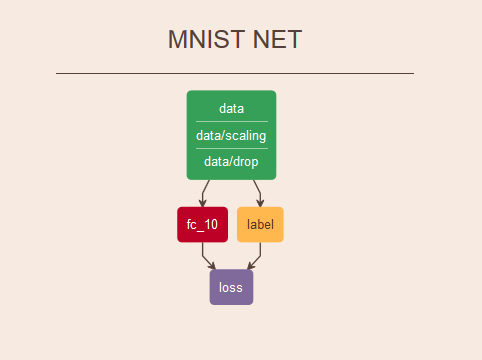
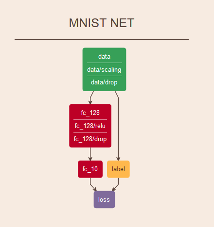
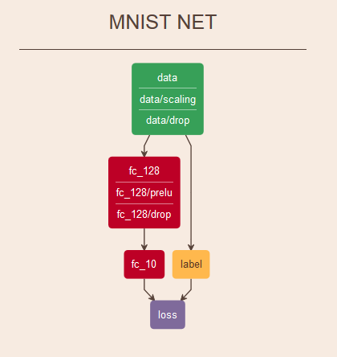
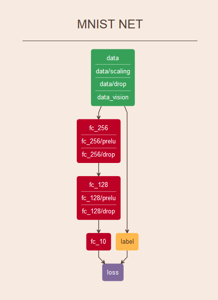
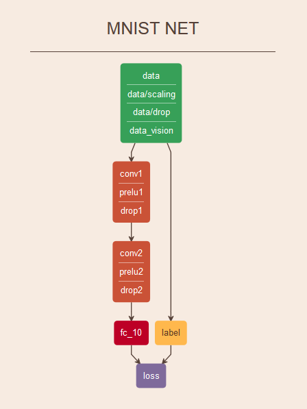
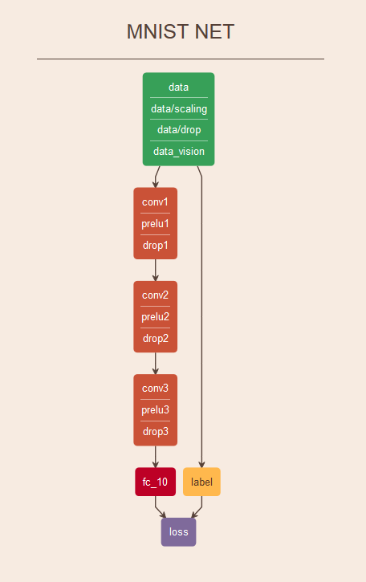
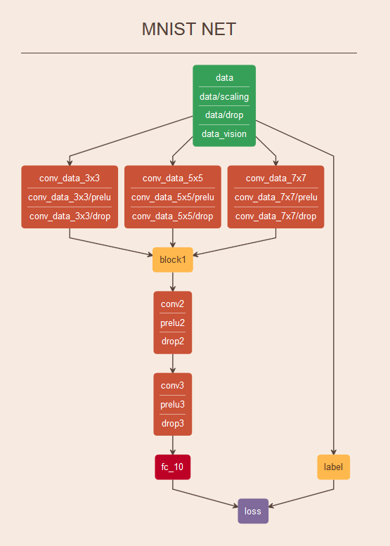
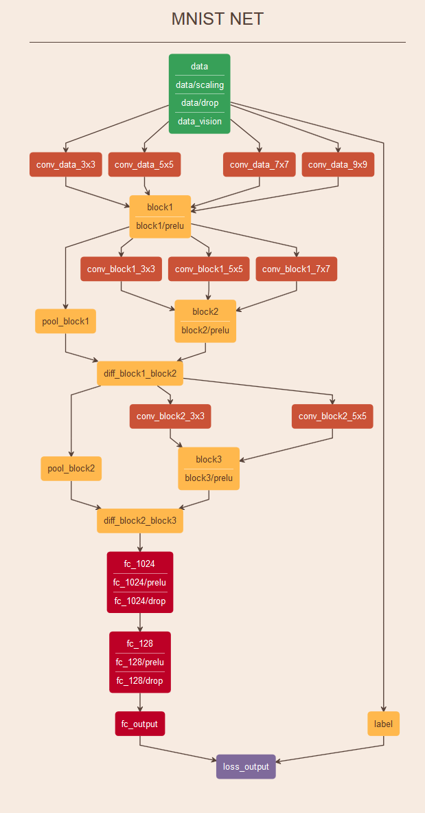

# MNIST

Deep learning pattern recognition on the famous mnist dataset [mnist dataset](http://yann.lecun.com/exdb/mnist/).

Dataset consists of 60.000 training samples and 10.000 test samples of hand-drawn digits of size 28x28 single channel pixels.

## Framework

All examples are trained and tested within the [caffe franework](caffe.berkeleyvision.org/).

Custom layers will be noted with and asterisk.

Networks are visualized in [netscope](https://ethereon.github.io/netscope/#/editor)

## Preprocessing 

* Pixels are scaled from [0 256] to [-1 +1].

* Randomly zeroing pixels out with 1% probability

* Cropping window of 25x25 to 27x27

* Custom Affine and noise transformation layer in some networks (called data_vision layer)

## Regularization

* weight decay 

## [Linear Classifier - Baseline](models/linear_classifier.prototxt)

### Notes

Accuracy after 500k iterations 0.925 ~ error 7.5%

Number of parameters : 6260

## [NN 2 Layer with ReLU](models/2_layer_NN_relu.prototxt.prototxt)

### Notes

Accuracy after 500k iterations 0.983 ~ error 1.17%

## [NN 2 Layer with PReLU](models/2_layer_NN_prelu.prototxt)

### Notes

Accuracy after 500k iterations 0.983 ~ error 1.17%

Faster convergence than ReLU

## [NN 3 Layer 256 - 128 - 10 with PReLU](models/3_layer_NN_256_128_10.prototxt)

### Notes

Accuracy after 500k iterations 0.986 ~ error 1.14%

## [NN 3 Layer 256 - 128 - 10 with PReLU and dataset expansion layer](models/3_layer_NN_256_128_10_with_dataset_expansion.prototxt)

### Notes

This one uses the custom dataset expansion layer that randomly transforms the input with noise and affine transformations

Accuracy after 500k iterations 0.9912 ~ error 0.88%

## [CNN 2 Layer (36 kernels 3x3 stride 2) (28 kernels 3x3 stride 1) with PReLU and dataset expansion](models/cnn_2_layer_dataset_expansion.prototxt)

### Notes

This one uses the custom dataset expansion layer that randomly transforms the input with noise and affine transformations

Accuracy after 3 x 500k iterations 0.9935 ~ error 0.65%

## [CNN 3 Layer (64 kernels 3x3 stride 1) (256 kernels 3x3 stride 2) (64 kernels 3x3 stride 2) with PReLU and dataset expansion](models/cnn_3_layer_with_dataset_expansion.prototxt)

### Notes

This one uses the custom dataset expansion layer that randomly transforms the input with noise and affine transformations

Accuracy after 3 x 500k iterations 0.9945 ~ error 0.55%

## [CNN 3 Stages Multiscale with PReLU and dataset expansion](models/cnn_3_stages_multiscale_with_dataset_expansion.prototxt)

### Notes

This one uses the custom dataset expansion layer that randomly transforms the input with noise and affine transformations

Accuracy after 3 x 500k iterations 0.9952 ~ error 0.48%

## [CNN 3 Stages Multiscale Residual with PReLU and dataset expansion](models/cnn_3_stages_multiscale_with_prelus_dataset_expansion.prototxt)

### Notes

This one uses the custom dataset expansion layer that randomly transforms the input with noise and affine transformations

Uses Residual network topology for faster convergence and higher accuracy

Accuracy after 500k iterations 0.9962 ~ error 0.38%

